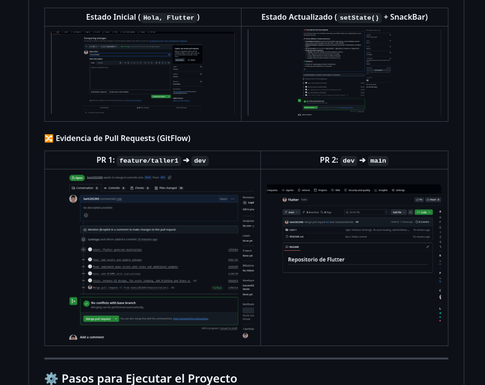
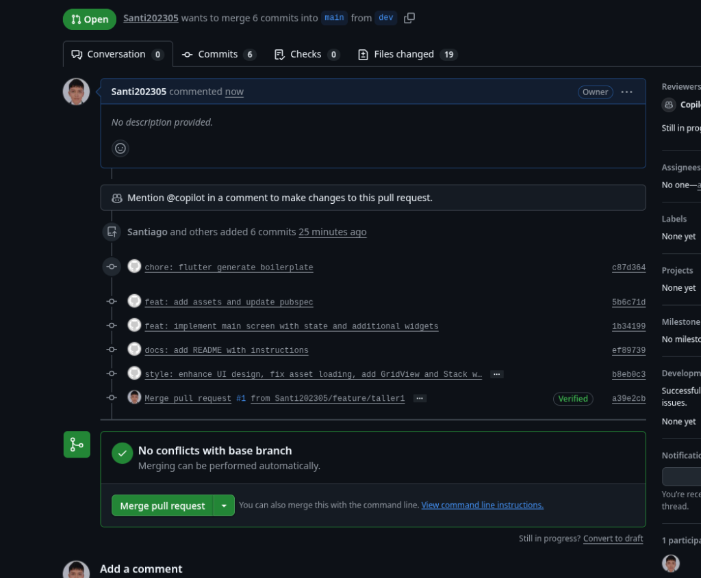

# 📱 Repositorio de Desarrollo de Aplicaciones Móviles - Flutter

Bienvenido al repositorio oficial del curso de **Desarrollo de Aplicaciones Móviles**. En este repositorio se integran todos los talleres y proyectos desarrollados utilizando la metodología **GitFlow** con un único repositorio centralizado.

---

## 👨‍💻 Datos del Estudiante
- **Nombre Completo:** Santiago
- **Asignatura:** Desarrollo de Aplicaciones Móviles
- **Repositorio Público:** [https://github.com/Santi202305/Flutter.git](https://github.com/Santi202305/Flutter.git)

---

## 🚀 Estructura del Repositorio y Ramas (GitFlow)

El control de versiones se administra mediante las siguientes ramas estables y de características:

- **`main`**: Rama de producción estable.
- **`dev`**: Rama principal de desarrollo e integración continua.
- **`feature/taller1`**: Rama del Taller 1 (integrada a `dev` y posteriormente a `main` vía Pull Requests).

```text
  main (producción) ◄────── (PR #2) ────── dev (desarrollo) ◄────── (PR #1) ────── feature/taller1
```

---

## 🛠️ Taller 1: StatefulWidget, setState() y Control de Versiones Git

### 📌 Descripción del Taller
Construcción de una interfaz moderna y reactiva en Flutter para demostrar el manejo de estado mutable con `setState()`, notificaciones con `SnackBar`, consumo de imágenes `Asset`/`Network`, y widgets avanzados (`Container`, `Stack`, `GridView`, `ListView`).

### 💡 Explicación Técnica: StatefulWidget y setState()

- **StatefulWidget:** En Flutter, un widget que requiere actualizar su interfaz de usuario en tiempo de ejecución debe extender de `StatefulWidget`. Se compone de dos clases: la configuración inmutable y la clase `State` que mantiene los datos mutables y la lógica visual en su método `build()`.
- **setState():** Es la función clave del framework que le notifica a Flutter que el estado interno del objeto ha cambiado. Al invocar `setState(() { ... })`, Flutter marca el widget como "dirty" (sucio) y vuelve a ejecutar el método `build()` de forma eficiente para reflejar los cambios en pantalla sin reiniciar toda la aplicación.

#### Extracto del Código Principal:
```dart
class _HomePageState extends State<HomePage> {
  String _appBarTitle = 'Hola, Flutter';

  void _toggleTitle() {
    setState(() {
      _appBarTitle = (_appBarTitle == 'Hola, Flutter') 
          ? '¡Título cambiado!' 
          : 'Hola, Flutter';
    });

    ScaffoldMessenger.of(context).showSnackBar(
      const SnackBar(
        content: Text('Título actualizado'),
        backgroundColor: Color(0xFF10B981),
      ),
    );
  }
}
```

---

## 📸 Evidencias Gráficas del Taller 1

### 1. Estado Inicial de la Aplicación
Muestra el título de la AppBar como *"Hola, Flutter"*, la tarjeta del estudiante "Santiago", la galería de imágenes (`Row` + `Stack`) y el `GridView`.



---

### 2. Estado Actualizado (`setState()` + SnackBar)
Tras presionar el botón *"Cambiar Título de la AppBar"*, se actualiza el título dinámicamente y se despliega un `SnackBar` flotante de color verde con el mensaje *"Título actualizado"*.


---

### 3. Evidencia de Pull Requests (GitFlow)

#### PR 1: Integración de `feature/taller1` ➔ `dev`


---

#### PR 2: Integración de `dev` ➔ `main`


---

## 💻 Pasos para Ejecutar el Proyecto (Multi-plataforma)

Cualquier persona puede clonar y probar este proyecto en **Windows, Linux, macOS, Navegador Web o Emulador Android/iOS**:

### 1. Clonar el Repositorio
```bash
git clone https://github.com/Santi202305/Flutter.git
cd Flutter/taller1
```

### 2. Obtener Dependencias
```bash
flutter pub get
```

### 3. Ejecutar según tu sistema operativo o plataforma:

- **En Windows:**
  ```bash
  flutter run -d windows
  ```

- **En Linux:**
  ```bash
  flutter run -d linux
  ```

- **En macOS:**
  ```bash
  flutter run -d macos
  ```

- **En Navegador Web (Chrome / Edge):**
  ```bash
  flutter run -d chrome
  ```

- **En Emulador Android / Dispositivo Físico:**
  ```bash
  flutter run
  ```
