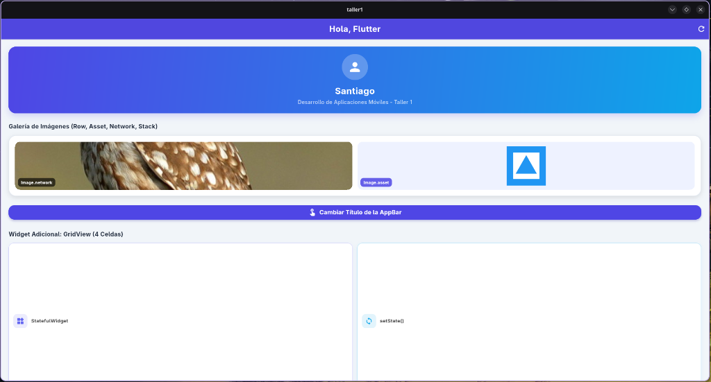
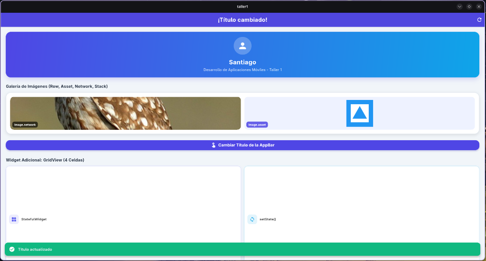
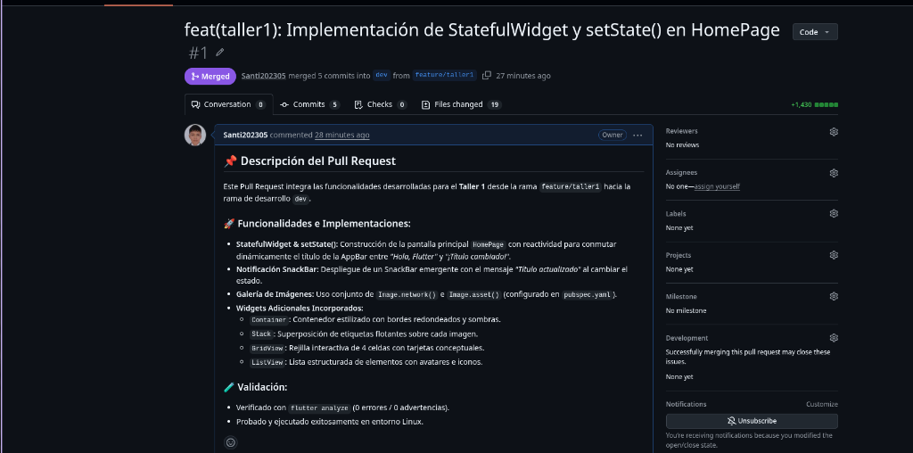
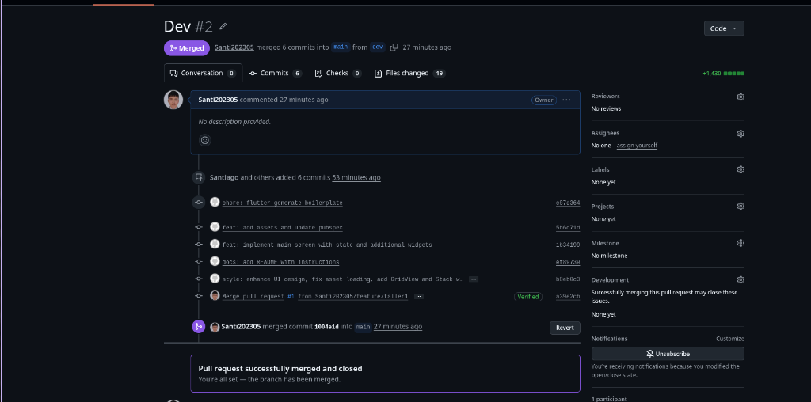

# 📱 Repositorio de Desarrollo de Aplicaciones Móviles - Flutter

Bienvenido al repositorio oficial del curso de **Desarrollo de Aplicaciones Móviles**. En este repositorio se integran todos los talleres y proyectos desarrollados utilizando la metodología **GitFlow** con un único repositorio centralizado.

---

## 👨‍💻 Datos del Estudiante
- **Nombre Completo:** Santiago
- **Asignatura:** Desarrollo de Aplicaciones Móviles
- **Repositorio Público:** [https://github.com/Santi202305/Flutter.git](https://github.com/Santi202305/Flutter.git)

---

## 🚀 Estructura del Repositorio y Ramas (GitFlow)

- **`main`**: Rama de producción estable.
- **`dev`**: Rama principal de desarrollo e integración continua.
- **`feature/taller1`**: Rama del Taller 1 (integrada a `dev` y posteriormente a `main` vía Pull Requests).

```text
  main (producción) ◄── PR #2 ── dev (desarrollo) ◄── PR #1 ── feature/taller1
```

---

## 🛠️ Taller 1: StatefulWidget, setState() y Control de Versiones Git

### 📌 Descripción
Construcción de una interfaz moderna y reactiva en Flutter para demostrar el manejo de estado mutable con `setState()`, notificaciones con `SnackBar`, consumo de imágenes `Asset`/`Network`, y widgets avanzados (`Container`, `Stack`, `GridView`, `ListView`).

### 💡 Explicación Técnica: StatefulWidget y setState()

- **StatefulWidget:** Widget que permite mantener estado mutable en tiempo de ejecución. Se compone de la clase widget (inmutable) y la clase `State` (mutable) que contiene las variables de estado y el método `build()`.
- **setState():** Método que notifica al framework que el estado interno cambió. Flutter marca el widget como "dirty" y vuelve a ejecutar `build()` para reflejar los cambios en la UI de forma eficiente.

```dart
class _HomePageState extends State<HomePage> {
  String _appBarTitle = 'Hola, Flutter';

  void _toggleTitle() {
    setState(() {
      _appBarTitle = (_appBarTitle == 'Hola, Flutter')
          ? '¡Título cambiado!'
          : 'Hola, Flutter';
    });

    ScaffoldMessenger.of(context).showSnackBar(
      const SnackBar(content: Text('Título actualizado')),
    );
  }
}
```

---

## 📸 Evidencias del Taller 1

### 1. Estado Inicial de la Aplicación
Título de la AppBar: *"Hola, Flutter"* — Tarjeta del estudiante, galería de imágenes (`Image.network` + `Image.asset` en un `Row` con `Stack`), botón y `GridView`.



---

### 2. Cambio de Título + SnackBar (`setState()`)
Tras presionar el botón, el título cambia a *"¡Título cambiado!"* y aparece el `SnackBar` flotante verde con *"Título actualizado"*.



---

### 3. Pull Request #1: `feature/taller1` ➔ `dev` (Merged)


---

### 4. Pull Request #2: `dev` ➔ `main` (Merged)


---

## 💻 Pasos para Ejecutar (Windows / Linux / Web)

```bash
# 1. Clonar el repositorio
git clone https://github.com/Santi202305/Flutter.git
cd Flutter/taller1

# 2. Instalar dependencias
flutter pub get

# 3. Ejecutar según tu plataforma
flutter run -d windows    # Windows
flutter run -d linux      # Linux
flutter run -d macos      # macOS
flutter run -d chrome     # Navegador Web
flutter run               # Android / iOS
```
