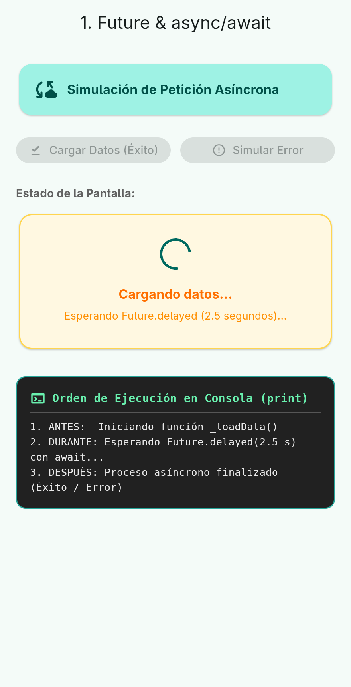
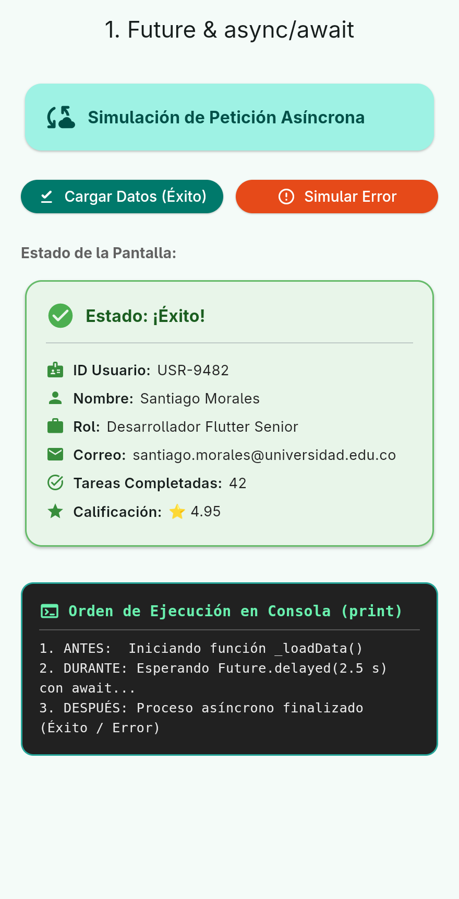
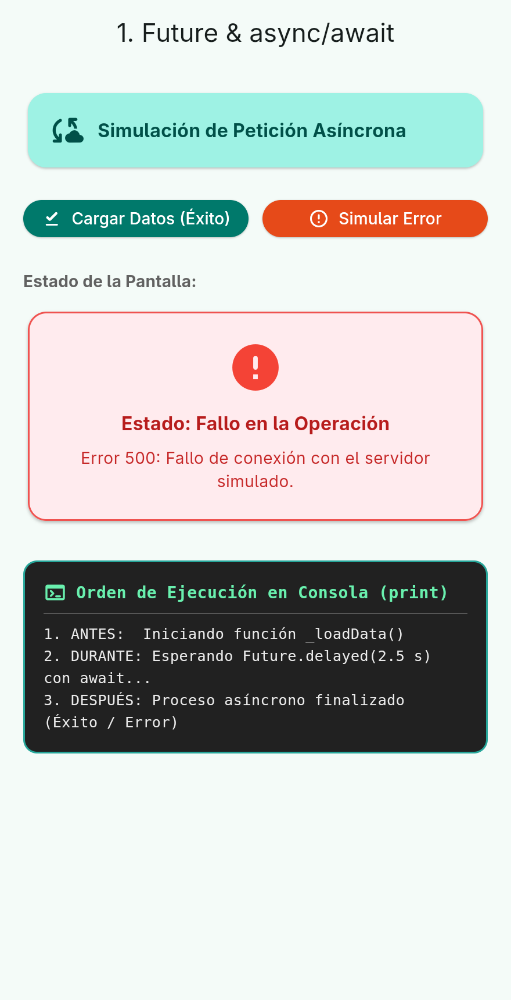
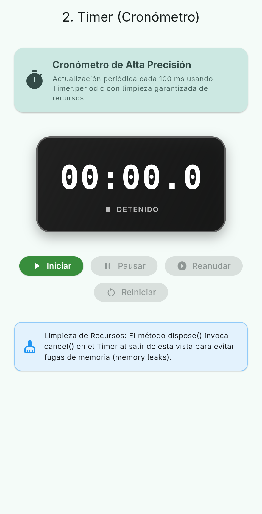
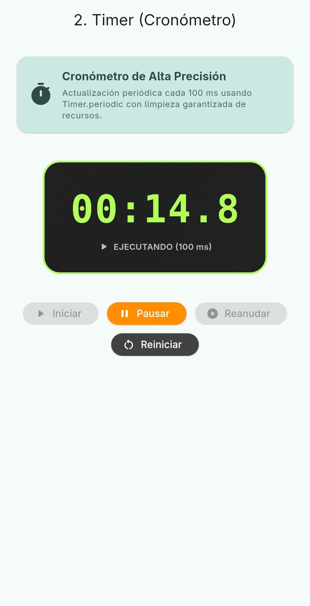
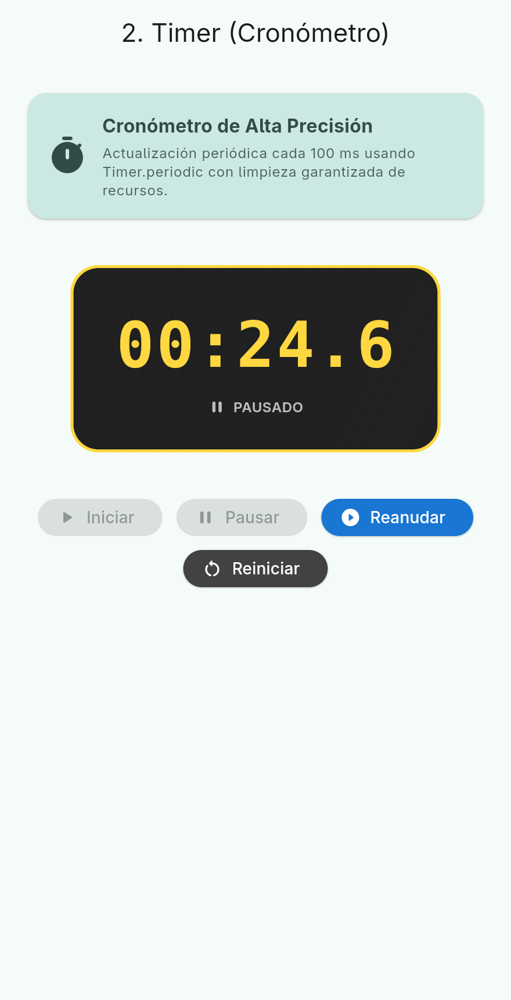
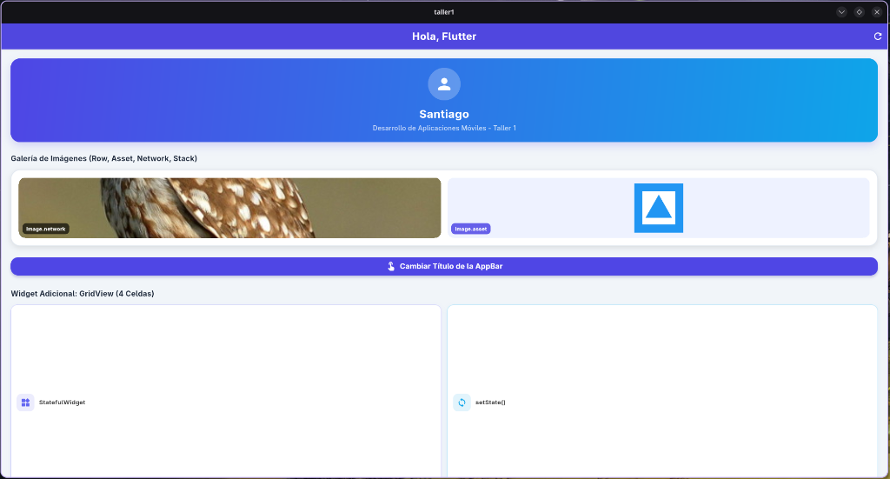
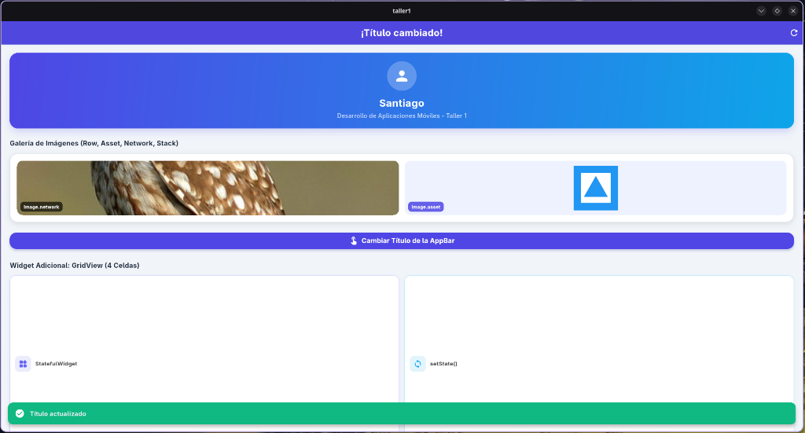
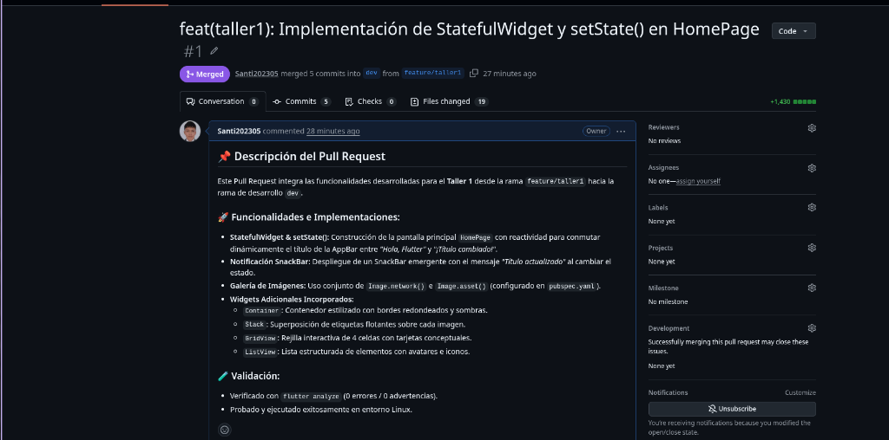
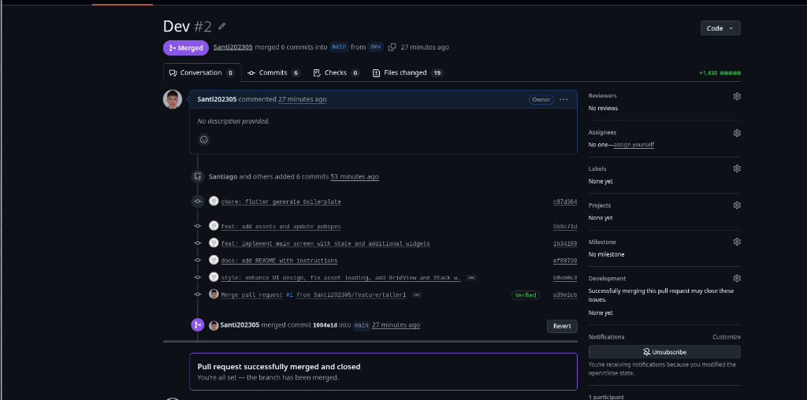

# 📱 Repositorio de Desarrollo de Aplicaciones Móviles - Flutter

Bienvenido al repositorio oficial del curso de **Desarrollo de Aplicaciones Móviles**. En este repositorio se integran todos los talleres y proyectos desarrollados utilizando la metodología **GitFlow** con un único repositorio centralizado.

---

## 👨‍💻 Datos del Estudiante
- **Nombre Completo:** Santiago Morales
- **Asignatura:** Desarrollo de Aplicaciones Móviles
- **Repositorio Público:** [https://github.com/Santi202305/Flutter.git](https://github.com/Santi202305/Flutter.git)

---

## 🚀 Estructura del Repositorio y Ramas (GitFlow)

- **`main`**: Rama de producción estable.
- **`dev`**: Rama principal de desarrollo e integración continua.
- **`feature/taller1`**: Rama del Taller 1 (integrada a `dev` y `main`).
- **`feature/taller_segundo_plano`**: Rama del Taller 2 (Asincronía, Timers e Isolates).

```text
  main (producción) ◄── PR #2 ── dev (desarrollo) ◄── PR #1 ── feature/taller_segundo_plano
```

---

## ⚙️ Taller 2: Asincronía con Future, Timer e Isolates (Procesamiento en Segundo Plano)

### 📌 Descripción
Desarrollo de una aplicación Flutter demostrativa para el manejo de tareas asíncronas y multihilo en segundo plano:
1. **Asincronía con `Future` y `async`/`await`:** Petición simulada de red con latencia de 2.5s, manejando los estados de *Cargando...*, *Éxito* y *Error*, imprimiendo el orden de ejecución en consola.
2. **Cronómetro con `Timer`:** Marcador digital de precisión con actualización cada 100 ms, botones (*Iniciar*, *Pausar*, *Reanudar*, *Reiniciar*) y cancelación limpia de recursos en `dispose()`.
3. **Multithreading con `Isolate`:** Ejecución de cálculos pesados CPU-bound (suma de primos hasta 30 millones) en un hilo secundario con `Isolate.spawn` y paso de mensajes mediante `ReceivePort`/`SendPort`, garantizando que la UI permanezca a 60 FPS sin congelarse.

---

### 💡 Guía Teórica: Cuándo Usar Cada Concepto

| Mecanismo | ¿Cuándo Usarlo? | Caso de Uso Típico | Hilo de Ejecución |
| :--- | :--- | :--- | :--- |
| **`Future`** | Operación asíncrona I/O que retornará un único valor o error en el futuro. | Consultas HTTP a APIs REST, lecturas/escrituras en BD local, SharedPreferences. | Hilo Principal (Event Loop) |
| **`async` / `await`** | Sintaxis declarativa para consumir `Futures` de forma secuencial y legible. | Esperar la respuesta de una API antes de actualizar el estado con `setState()`. | Hilo Principal (Event Loop) |
| **`Timer`** | Programación de tareas temporizadas diferidas o repetitivas a intervalos regulares. | Cronómetros, cuentas regresivas, animaciones de pulso, autoguardado periódico. | Hilo Principal (Event Loop) |
| **`Isolate`** | Tareas intensivas en CPU (CPU-bound) que requieren millones de operaciones lógicas. | Procesamiento/compresión de imágenes, cifrado criptográfico, parsing de JSON gigante. | **Hilo Secundario (Nativo CPU)** |

---

### 📐 Flujo de Pantallas y Arquitectura de Taller 2

```text
               ┌──────────────────────────────────────────────┐
               │    MainNavigationContainer (NavigationBar)   │
               └──────────────────────┬───────────────────────┘
                                      │
        ┌─────────────────────────────┼─────────────────────────────┐
        ▼                             ▼                             ▼
 ┌──────────────┐              ┌──────────────┐              ┌──────────────┐
 │ FutureScreen │              │ TimerScreen  │              │IsolateScreen │
 └──────┬───────┘              └──────┬───────┘              └──────┬───────┘
        │                             │                             │
        ▼                             ▼                             ▼
┌──────────────┐              ┌──────────────┐              ┌──────────────┐
│FutureService │              │Timer.periodic│              │IsolateService│
│(Future.delay)│              │(cancel in    │              │(Isolate.spawn│
│ 2.5s delay   │              │ dispose())   │              │ Receive/Send)│
└──────────────┘              └──────────────┘              └──────────────┘
```

---

### 📸 Evidencias del Taller 2 (HD Nativas)

#### 1. Future & async/await (Estados: Cargando / Éxito / Error)
Demostración del servicio simulado y estados de interfaz de usuario.




---

#### 2. Timer (Cronómetro con Iniciar, Pausar, Reanudar, Reiniciar)
Marcador digital dinámico y gestión segura de memoria.




---

#### 3. Isolate (Procesamiento Pesado en Segundo Plano)
Cómputo en hilo nativo de CPU manteniendo animación a 60 FPS sin congelar la UI.


---

## 🛠️ Taller 1: StatefulWidget, setState() y Control de Versiones Git

### 📌 Descripción
Construcción de una interfaz moderna y reactiva en Flutter para demostrar el manejo de estado mutable con `setState()`, notificaciones con `SnackBar`, consumo de imágenes `Asset`/`Network`, y widgets avanzados (`Container`, `Stack`, `GridView`, `ListView`).

### 📸 Evidencias del Taller 1

#### 1. Estado Inicial de la Aplicación


#### 2. Cambio de Título + SnackBar (`setState()`)


#### 3. Pull Request #1: `feature/taller1` ➔ `dev` (Merged)


#### 4. Pull Request #2: `dev` ➔ `main` (Merged)


---

## 💻 Pasos para Ejecutar (Windows / Linux / Web)

```bash
# 1. Clonar el repositorio
git clone https://github.com/Santi202305/Flutter.git

# 2. Ejecutar Taller 2 (Asincronía e Isolates)
cd Flutter/taller2
flutter pub get
flutter run -d linux      # Linux Desktop
flutter run -d windows    # Windows Desktop
flutter run -d chrome     # Navegador Web

# 3. Ejecutar Taller 1 (StatefulWidget)
cd ../taller1
flutter pub get
flutter run -d linux
```
