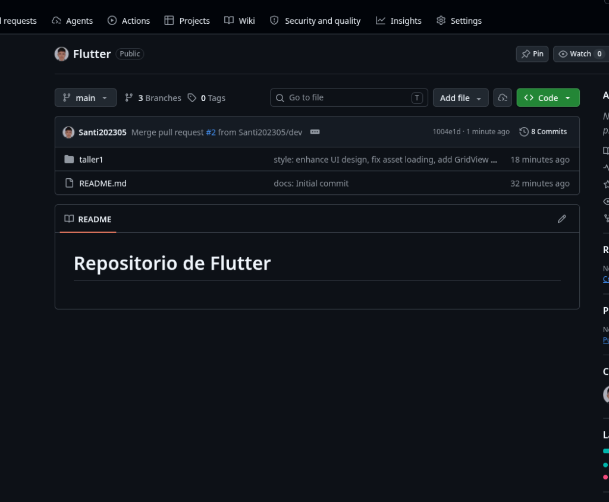

# 💙 Taller 1: StatefulWidget y Control de Versiones

## 👨‍💻 Datos del Estudiante
- **Nombre Completo:** Santiago
- **Asignatura:** Desarrollo de Aplicaciones Móviles
- **Repositorio:** [https://github.com/Santi202305/Flutter.git](https://github.com/Santi202305/Flutter.git)
- **Rama:** `feature/taller1`

---

## 🎯 Objetivo del Taller
Construir una pantalla básica interactiva en Flutter utilizando `StatefulWidget` para evidenciar el manejo de estado reactivo mediante `setState()`, integrando notificaciones emergentes con `SnackBar`, consumo de imágenes mediante `Image.network()` e `Image.asset()`, y la incorporación de widgets avanzados (`Container`, `Stack`, `GridView`, `ListView`).

---

## 💡 Explicación de StatefulWidget y setState()

En Flutter, las pantallas interactivas utilizan la clase `StatefulWidget` para gestionar datos que cambian con el tiempo:
1. **StatefulWidget:** Declara el widget reactivo.
2. **State:** Almacena las variables mutables y define el método `build()` que renderiza la pantalla.
3. **setState():** Notifica al motor de Flutter que los datos han cambiado, provocando que se vuelva a llamar a `build()` de forma optimizada para actualizar la interfaz.

---

## 📸 Evidencias Gráficas de la Aplicación

### 1. Estado Inicial de la Aplicación
Muestra el título de la AppBar como *"Hola, Flutter"*, el encabezado del estudiante, la galería en `Row` y los widgets adicionales.


---

### 2. Estado Actualizado (`setState()` + SnackBar)
Tras presionar el botón *"Cambiar Título de la AppBar"*, se actualiza el título dinámicamente y se despliega un `SnackBar` flotante indicando *"Título actualizado"*.


---

## 🔀 Evidencia del Flujo de Git (Pull Requests)

### Integración de `feature/taller1` hacia `dev`


---

### Integración de `dev` hacia `main`


---

## 💻 Instrucciones de Ejecución Multi-plataforma

Puedes ejecutar y probar este proyecto en cualquier plataforma:

```bash
# 1. Entrar a la carpeta del proyecto
cd taller1

# 2. Instalar paquetes
flutter pub get

# 3. Ejecutar según tu sistema:
flutter run -d windows    # Para Windows
flutter run -d linux      # Para Linux
flutter run -d macos      # Para macOS
flutter run -d chrome     # Para Navegador Web
flutter run               # Para Android / iOS
```
