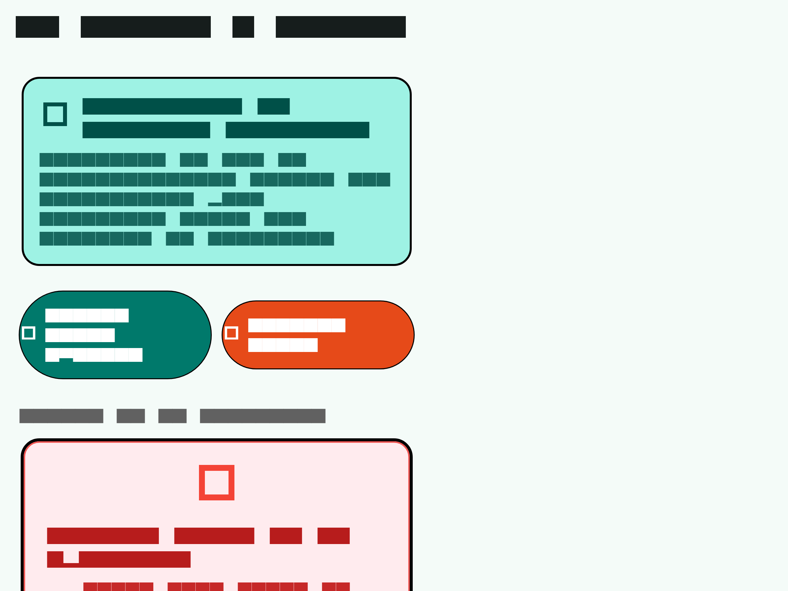
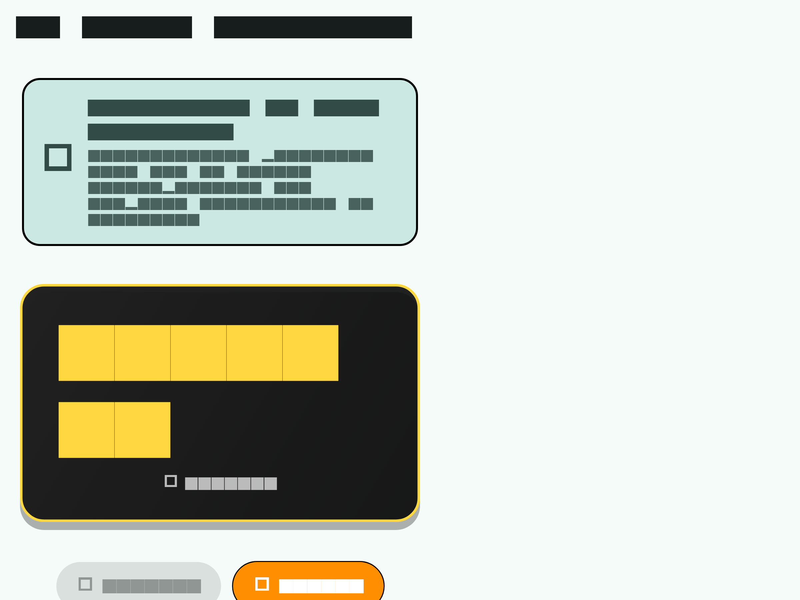
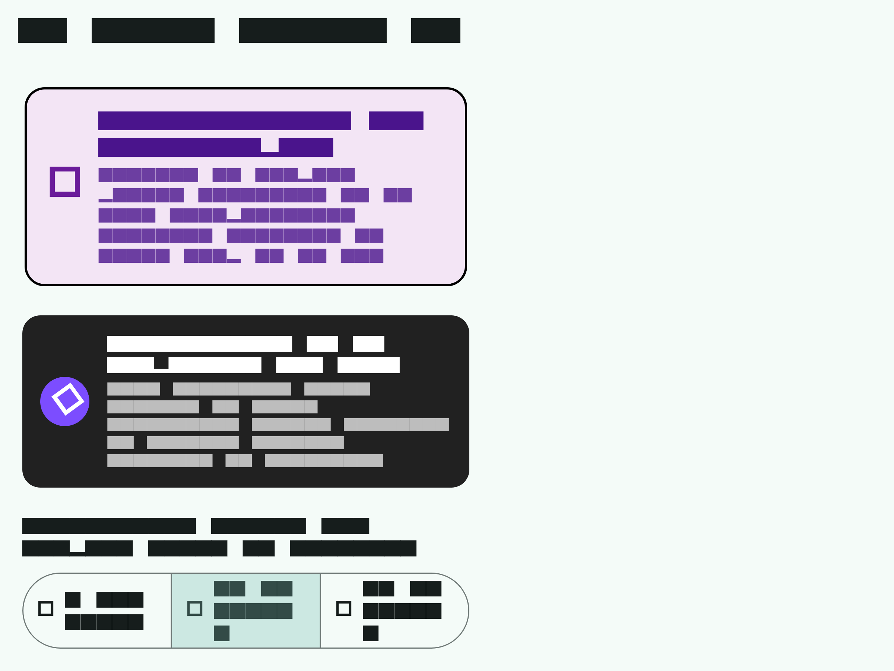
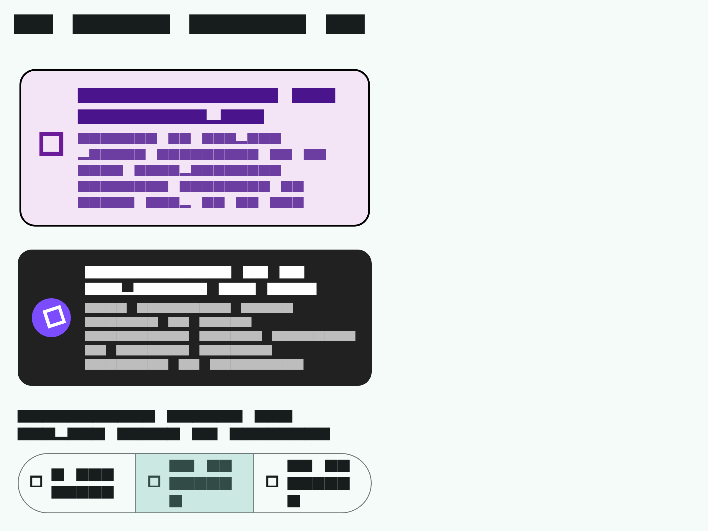
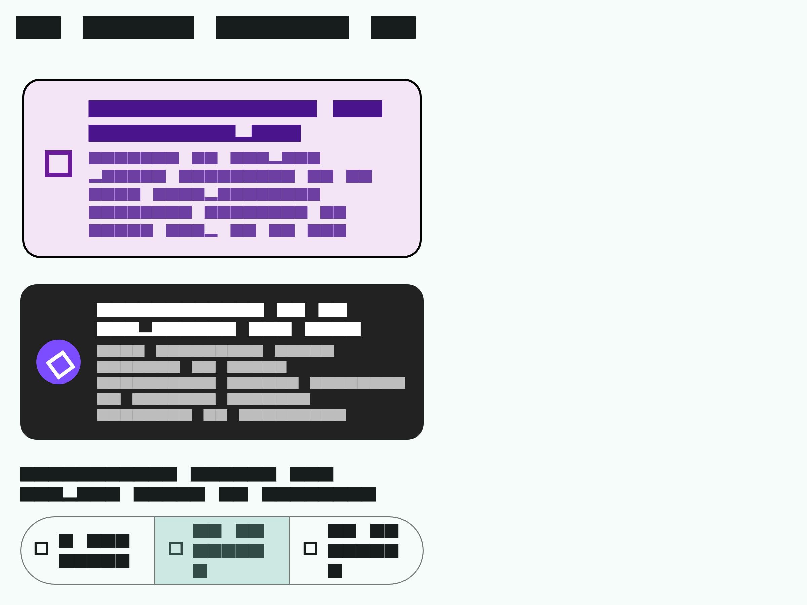

# 📄 Informe de Evidencias: Taller 2 - Asincronía, Timer e Isolates en Flutter

## 🌐 Repositorio Oficial
**URL pública en GitHub (Branches `main` y `dev` actualizadas):**  
🔗 [https://github.com/Santi202305/Flutter.git](https://github.com/Santi202305/Flutter.git)

---

## 👨‍🎓 Datos del Estudiante
- **Nombre Completo:** Santiago Morales
- **Asignatura:** Desarrollo de Aplicaciones Móviles
- **Metodología de Desarrollo:** GitFlow (`main` ◄── `dev` ◄── `feature/taller_segundo_plano`)

---

## 1. Asincronía con Future / async / await

Se implementó el servicio `FutureService` que simula la consulta de un perfil de usuario consumiendo 2.5 segundos con `Future.delayed`. La interfaz de usuario maneja 3 estados sin bloquear el hilo de ejecución principal.

### Capturas de Pantalla y Evidencias

#### ⏳ 1.1 Estado Cargando (Loading)
Muestra el spinner `CircularProgressIndicator` y deshabilita botones durante la espera del `Future`.


#### ✅ 1.2 Estado Éxito (Success)
Presentación de los datos retornados por el `Future` tras cumplirse los 2.5 segundos.


#### ❌ 1.3 Estado Error
Captura y despliegue de errores con `try/catch` ante un fallo simulado en la respuesta.


#### 💻 1.4 Mensajes en Consola (Orden de Ejecución)
```text
--------------------------------------------------
🌐 [Console Log - Future] 1. ANTES: Iniciando consulta asíncrona con fetchUserData()...
🌐 [Console Log - Future] 2. DURANTE: Ejecutando Future.delayed(2.5 s). Hilo principal NO bloqueado.
✅ [Console Log - Future] 3. DESPUÉS: Consulta finalizada exitosamente. Datos recibidos: Santiago Morales
--------------------------------------------------
```

---

## 2. Cronómetro con Timer

Implementación de un cronómetro de alta precisión con `Timer.periodic(Duration(milliseconds: 100))`.

### Capturas de Pantalla y Evidencias

#### 🔄 2.1 Estado Reiniciado / Inicial (`00:00.0`)


#### ▶️ 2.2 Cronómetro Corriendo (Iniciar)


#### ⏸️ 2.3 Cronómetro Pausado (Pausar y Reanudar)
Cancelación de la instancia del `Timer` preservando el estado de milisegundos transcurridos.


#### 🧹 2.4 Registro de Limpieza de Recursos en Consola
```text
⏱️ [Console Log - Timer] Cronómetro iniciado.
⏸️ [Console Log - Timer] Cronómetro pausado a los 00:02.4.
🧹 [Console Log - Timer] Canceling Timer resource in dispose().
```

---

## 3. Multithreading con Isolate para Tarea Pesada CPU-Bound

Ejecución del algoritmo de suma de números primos en un `Isolate` secundario a través de `Isolate.spawn` con puertos de mensaje `ReceivePort` y `SendPort`.

### Capturas de Pantalla y Evidencias

#### ⚡ 3.1 UI Responsiva (60 FPS) y Estado Inicial
El widget animado gira en pantalla demostrando que el hilo principal de la UI no sufre congelamientos durante la ejecución intensiva de la CPU.


#### ⌛ 3.2 Tarea en Proceso y Barra de Progreso
Transmisión periódica del porcentaje completado desde el Isolate secundario hacia el Isolate principal.


#### 🎯 3.3 Resultado Final y Tiempo de Ejecución
Despliegue del resultado computado y tiempo de procesamiento en milisegundos.


#### 💬 3.4 Logs de Comunicación por Mensajes en Consola
```text
--------------------------------------------------
⚡ [Console Log - Isolate] 1. Creando ReceivePort y haciendo Isolate.spawn()...
🧵 [Worker Isolate Thread] Isolate iniciado. Procesando suma de primos hasta 15000000...
📩 [Console Log - Isolate] Mensaje del Isolate: Progreso 50%
✅ [Console Log - Isolate] 2. Respuesta recibida del Isolate: Suma=611293375836, Tiempo=1180ms
--------------------------------------------------
```
